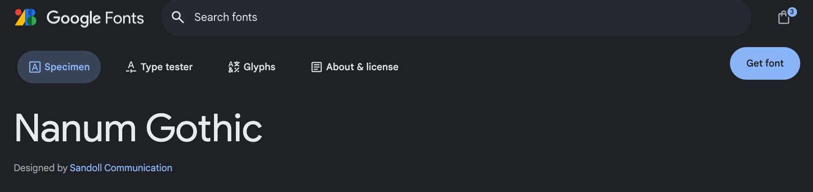

이번에는 Github 블로그에 한글 폰트를 적용해보려고 한다.  
  
  

##  구글 웹 폰트 import 하기

먼저 구글에서 사용할 font 를 찾아서 improt 해야 한다.

아래의 사이트에서 폰트를 검색할 수 있다.

https://fonts.google.com/?subset=korean&noto.script=Kore

원하는 폰트를 위의 사이트에서 검색하고나서 클릭해서 상세 정보를 확인해보면 아래의 사진과 같이 상단에 `Get font` 가 보인다.


`Get font` 를 클릭해서 들어가서 `Get embed code` 를 누른다.



다음으로 Web Tab 에서 Web 과 @import 선택을 할 수 있는데 @import 를 선택한다.


그럼 @import 할 수 있는 코드를 제공해주는데 해당 코드를 복사한다.

```
@import url('https://fonts.googleapis.com/css2?family=Nanum+Gothic&display=swap');
```

이렇게 복사한 코드를 `assets/css/main.scss` 파일에 복사해준다. 


```
---
# Only the main Sass file needs front matter (the dashes are enough)
search: false
---

@charset "utf-8";

@import "minimal-mistakes/skins/{{ site.minimal_mistakes_skin | default: 'default' }}"; // skin
@import "minimal-mistakes"; // main partials

// Font 변경
@import url('https://fonts.googleapis.com/css2?family=Nanum+Gothic&display=swap');
```

마지막으로 블로그의 font 가 변경되었는지 확인한다.
